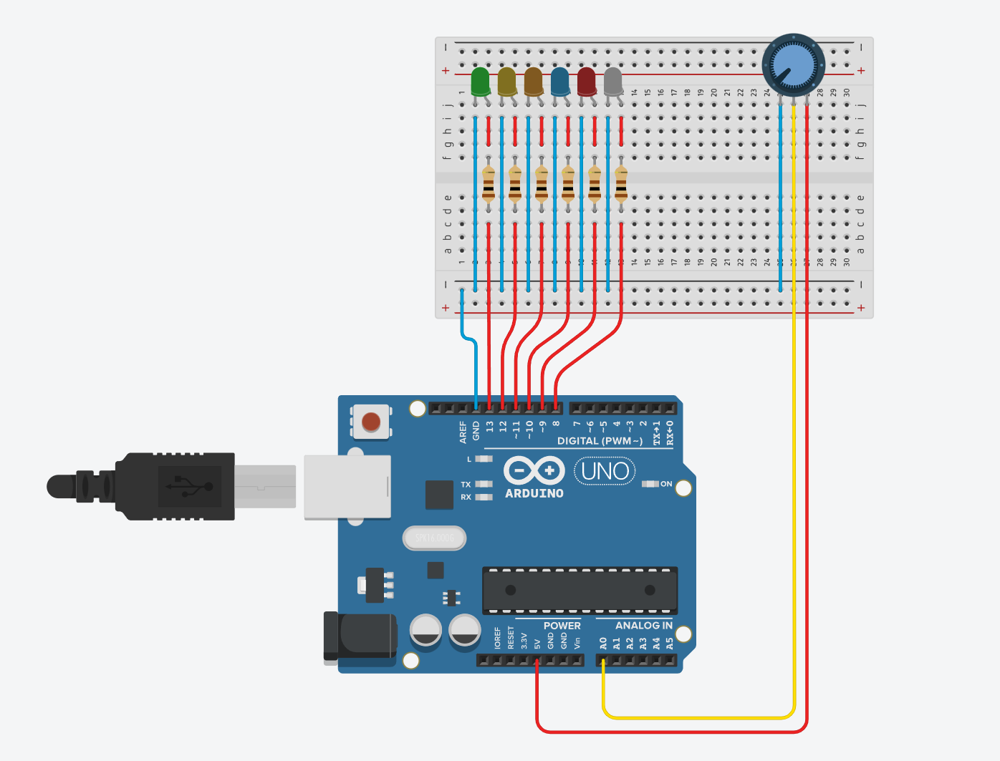
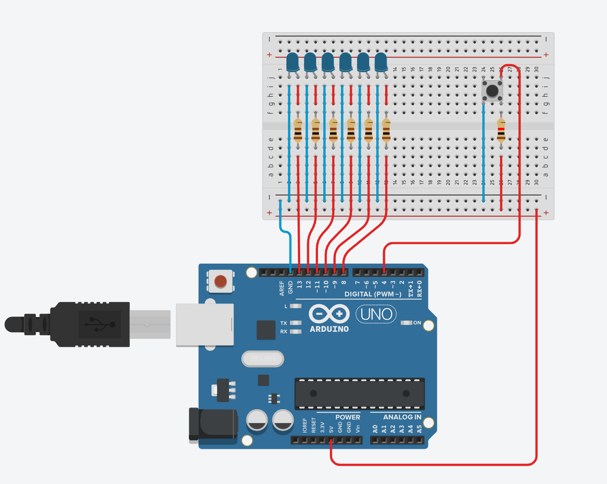
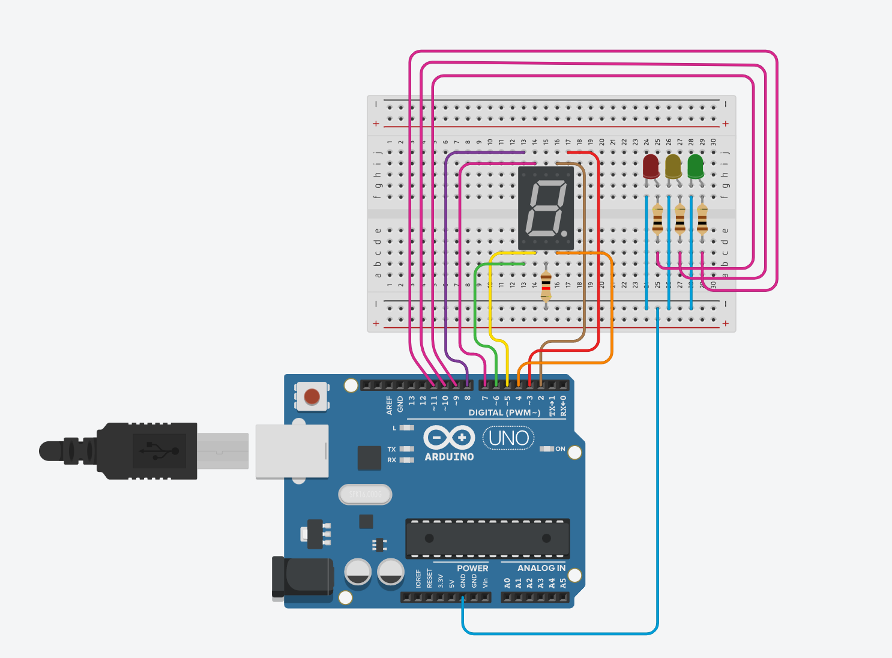

# Ardunio Learning

## 1. Use 6 to 12 LEDs and one potentiometer, control LEDs based-on potentiometer value.

Hint: use map() function

## 2. Simulation the Dice Roller game, use 6 LEDs and 1 button. When button is pressed for the first time, all the lights turn on and show the number that the dice rolled based on the number of lights displayed. This number of lights will have to stop for 1 second for the user to monitor and will blink 6 times. Continuing when you press the button next time.

## 3. Simulation the Traffic light by 1 Seven Segment Display and three color LEDs (Green, Yellow, and Red).

